# What's New in Dynamics GP in October 2024

This page lists enhancements to Dynamics GP in the October 2024 release. The Dynamics GP October 2024 release enhances different areas of the product.

For an overview and additional details for key enhancements, see the [Dynamics GP Blog](https://community.dynamics.com/gp/b/dynamicsgp/posts/microsoft-dynamics-gp-october-2024---feature-blog-series-schedule).

## Core Features

Functionality has been added across the core modules of Microsoft Dynamics GP.

### Email RM Statement with Multicurrency Blank Form

In the October 2024 release, we have updated the Print RM Statement functionality to enable emails with forms other than the Blank Form. Now, if you select any form type, the Email Options and the Email ribbon action will both be enabled. Two additional statement templates are added as well: RM Statement Long form and MC Statement Long Form.

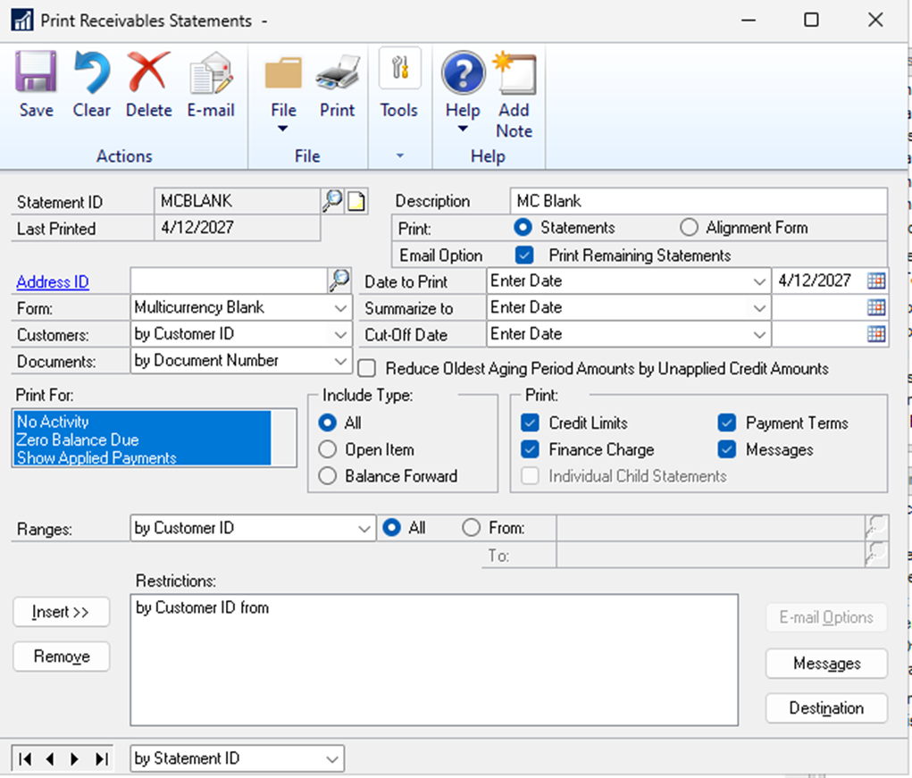

### Mask ID on Payables 1099’s

There is now an option available on the Print 1099 window to mask the vendor's Tax identification number. When you mark the checkbox and print a 1099, the Tax ID number will print with the first 5 numbers as an X.

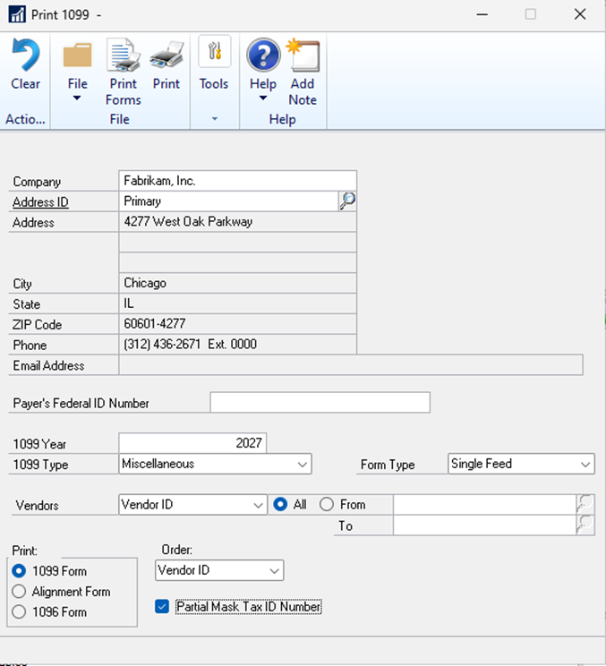

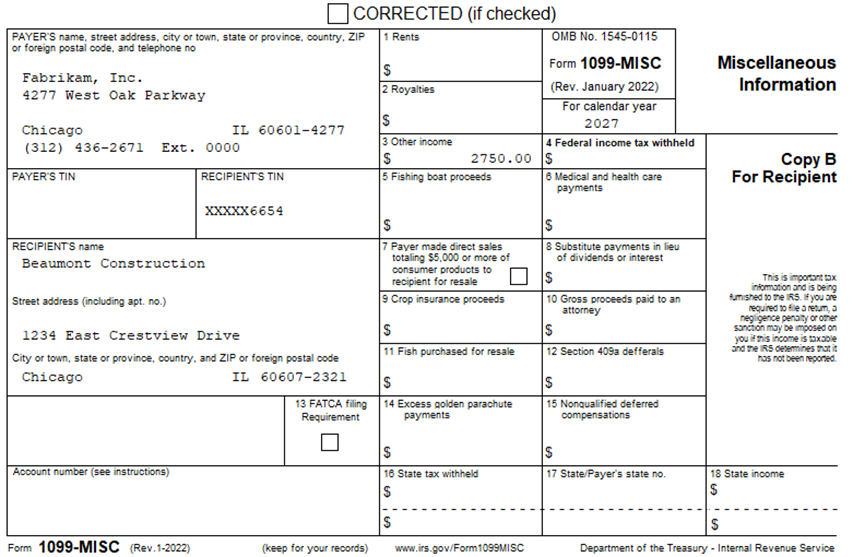

### Reprint EFT payment Register

In the Purchasing Posting Journal Options Report selection, the EFT Payment Register has been added in order to reprint the report after posting a Payables batch.  

### Print Historical Aged Trial Balance when voucher number has special characters

The Print Historical Aged Trial Balance report will show the posted information when a voucher number or a payment number is posted with special characters.

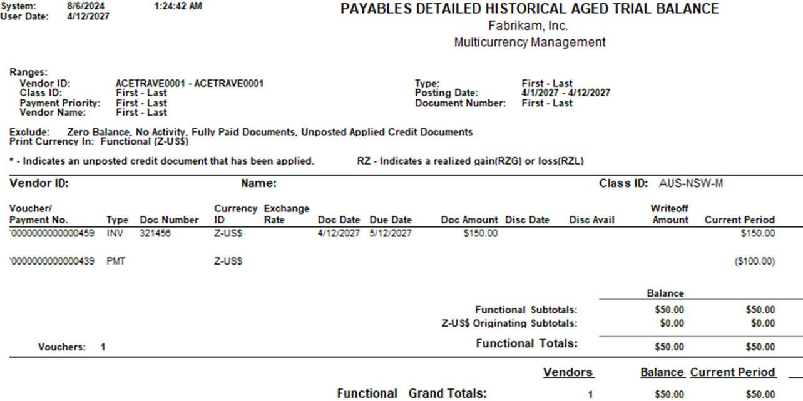

### Default Vendor Class Update Option to No

If you edit a vendor record and modify the vendor class ID, the default option when changing the vendor class ID on a vendor will be to not roll down changes.

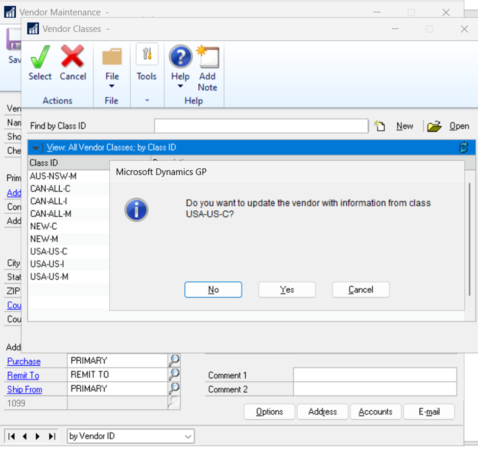

### Restrict Edit 1099 Transaction Information by Calendar Year

With this October release, we have added changes for the edit 1099 information.  Now, there is an option in the Documents drop down for Calendar Year Paid. When selected, there is a Year ddl to select. This will show you a filtered list of 1099 transactions that were paid in the calendar year selected.

There is a new zoom on the 1099 Details window or the 1099 Inquiry window to open the Edit 1099 transactions restricted by year. This will allow you to find the details more quickly for transactions that were paid in a specified calendar year. In addition, there is a new report on the Edit 1099 Transactions window to print the information you have filtered to.

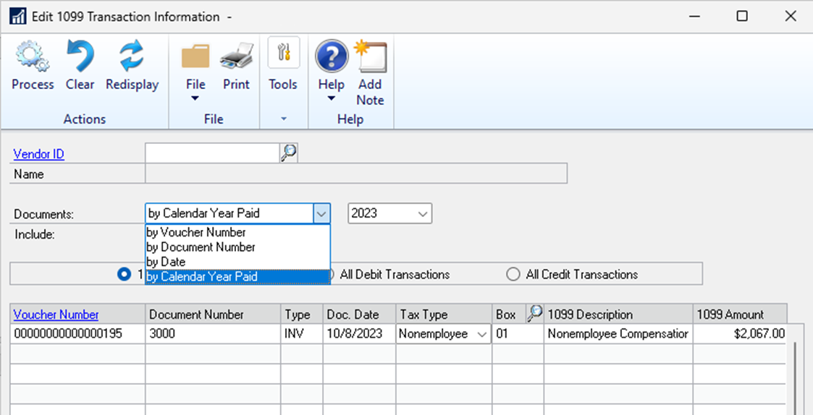

### Payables Transaction Remit to Address Display

There is now an expansion selection in Payables Transaction Entry to view the Remit to Address details for the selected address ID.

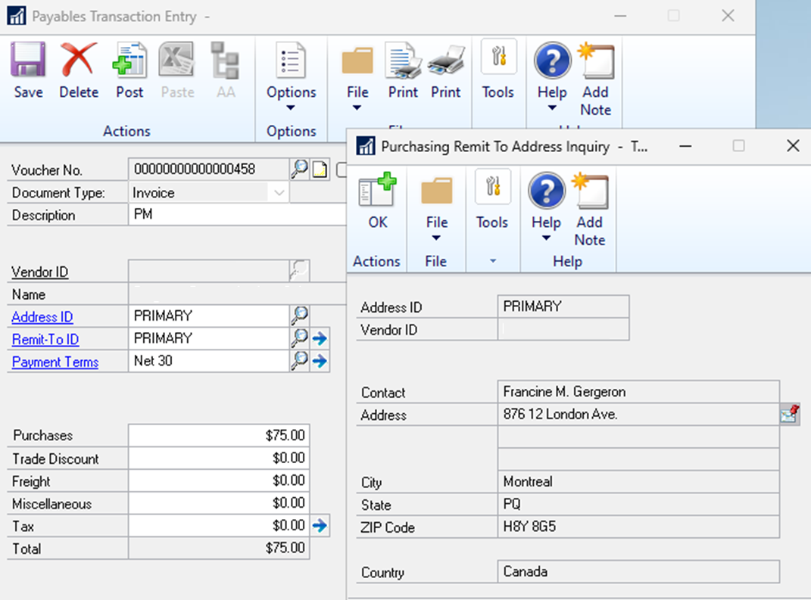

### Save Remit to Address Details to History

Payables transaction Remit to Address Transaction Details will be saved when a payables transaction is posted. These details will be saved in a new table PM80810. You can now view the saved Remit to Address on PM Transaction once posted from PM Transaction Entry Zoom. In addition, Payment processing will verify actual remit to address details when combining transactions to a single payment.

### Credit Card Payments setup as Check Cards in PM Missing Originating information in Bank Rec

When you set up a credit card from a checkbook in a non-functional currency, the originating amounts will be displayed correctly on the Checkbook Register.

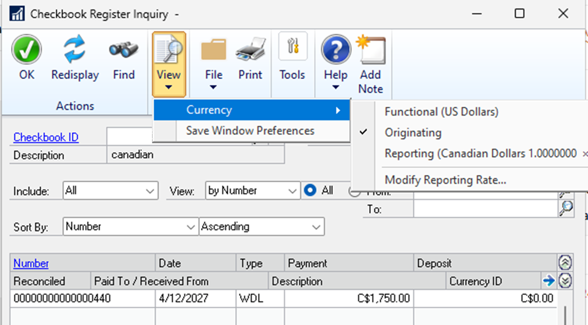

### Email address on Doc Type display emails from cust/vend when open email detail

A vendor or customer transaction will display the email address information on the transaction as to how they are assigned in the customer or vendor email setup.

For example:

* A customer or a vendor is setup to email by document type.
* You enter a Purchase Order and you view the email information to verify or edit.
* The system will display email addresses how they are assigned in the email setup

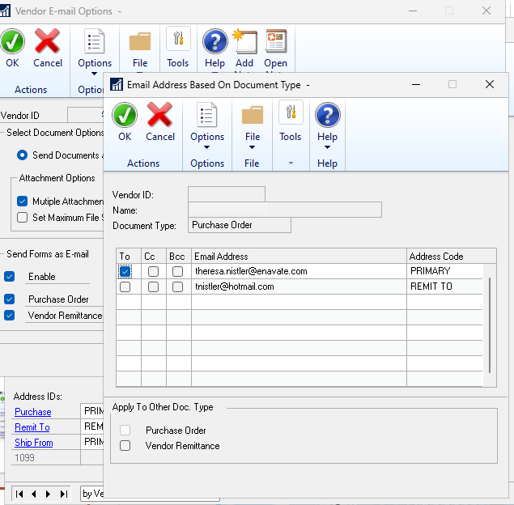

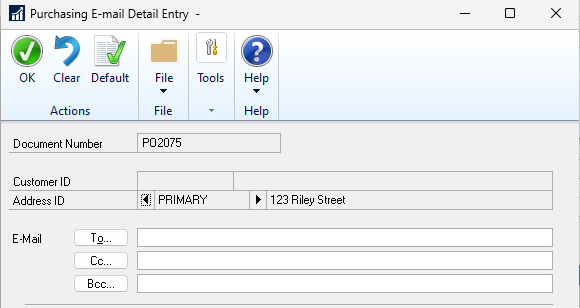
 
### Sales Document Inquiry Changes

There is now a drill down to Sales Document Detail Inquiry Zoom on Document Number and Orig Number fields on the Sales Document Inquiry window. When you drill down, it will display that selected document in the Sales Transaction Inquiry window.

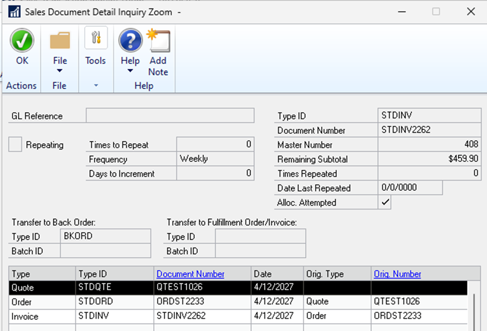

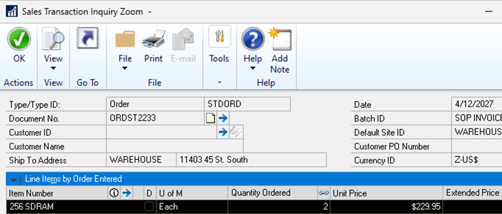

### Link SOP Print Options to SOP Document Type

When you enter a certain transaction type in Sales Transaction Entry, and then you select to print, the system will default the SOP Print options based on the document type. If you are entering a SOP Quote and choose print, the settings for Quote will automatically be marked in the Print Options window. The format will default from the Document ID Setup.

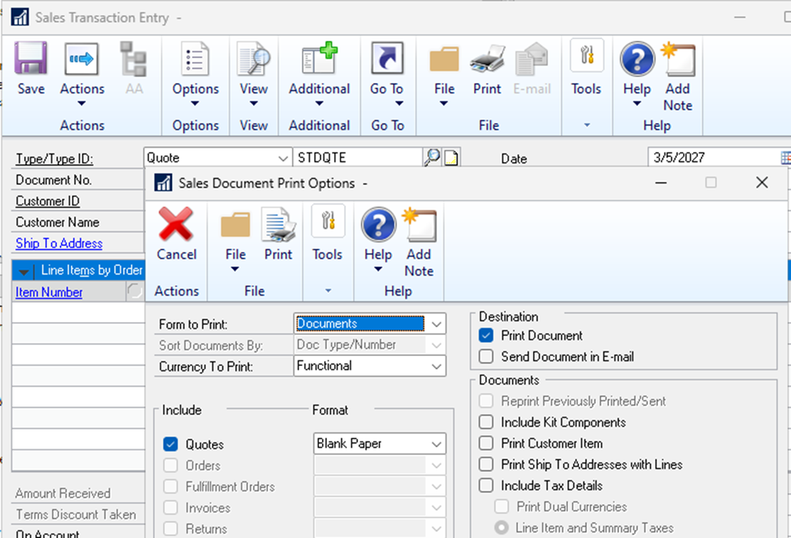

### Mass email reports from Report Navigation lists

Now when you are working on a Reports Navigation list, you will be able to mark multiple reports that are set to email and by using the Send action on the ribbon, you can email more than one report at a time.

### PO Delete Lines action available in PO Entry drop down

On Purchase Order Entry, there are different ways to delete a line that is on the PO. Now, the PO Delete Line action is also available in the PO entry drop down.

### Payroll Monthly Deduction Maximum

With the October 2024 release, there is another deduction maximum limit available in U.S. Payroll. You can now add a Monthly maximum field for Payroll deduction Setup. Or add a Monthly maximum for Payroll deduction entry at the employee level. When you are processing payroll, the limit hierarchy will be as follows: 1 - Pay Period 2 - Monthly 3 - Shared Deduction 4 - Calendar 5 - Fiscal 6 - Lifetime.

The maximum will be considered during Computer check calculation using user date. If you are entering a manual payment and the amount is over the deduction maximum, a warning will be given.

### Payroll Monthly Benefit Maximum

There is also another benefit maximum limit available in U.S. Payroll. You can now add a Monthly maximum field for Payroll benefit Setup. Or add a Monthly maximum for Payroll benefit entry at the employee level. When you are processing payroll, the limit hierarchy will be as follows: 1 - Pay Period 2 - Monthly 3 - Shared Benefit 4 - Calendar 5 - Fiscal 6 - Lifetime.

The maximum will be considered during Computer check calculation using user date. If you are entering a manual payment, and the amount is over the benefit maximum a warning will be given.

### Mask ID on Payroll 1099-R

Similar to the Payables 1099 change, there is now an option available on Print 1099-R window to mask the employee's Social Security number. When you mark the checkbox and print a 1099, the Social Security number will print with the first 5 numbers as an X.

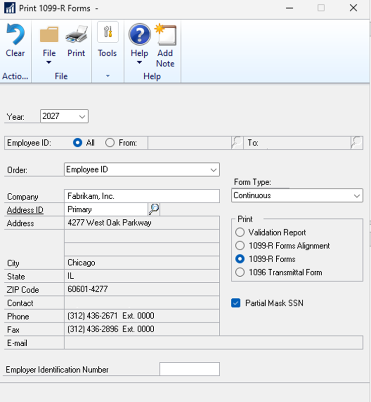

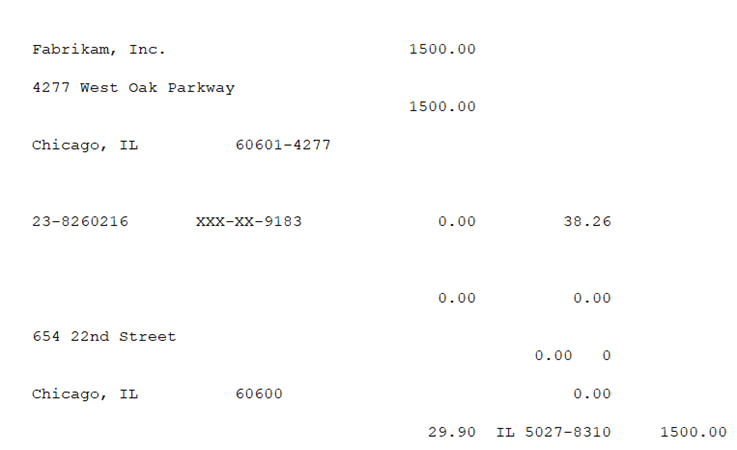

### Workflow emails trim trailing zeroes

With the October 2024 release, we're continuing to improve the workflow emails. Now, in addition to using the item detail decimals for formatting, the workflow emails will trim trailing zeroes.

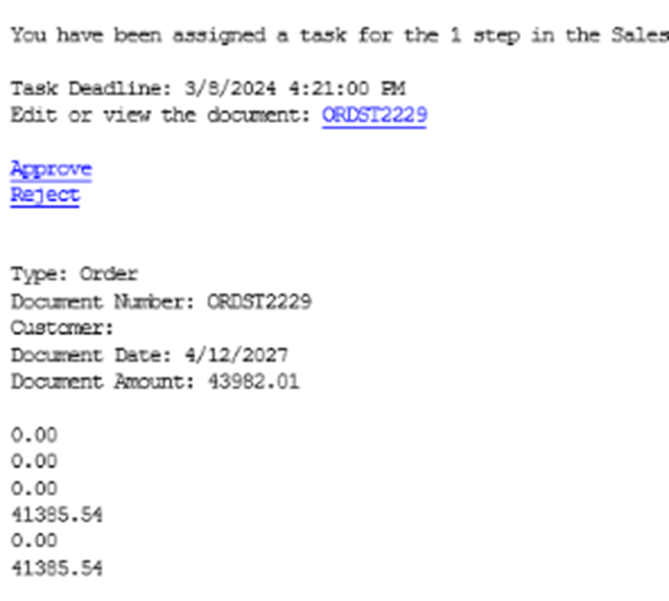